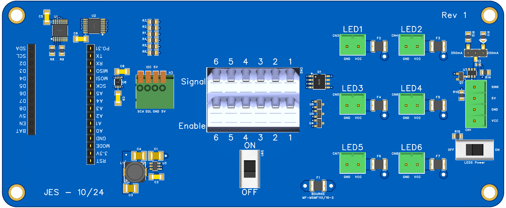

# Neopixel 6 Display Controller

A control board for up to 6 NZR (neopixel/WS28*) displays. This control board was designed to be used with a [Circuit Dojo - nRF9160 Feather](https://github.com/circuitdojo/nrf9160-feather), but can be used with any [Adafruit Feather compatible](https://learn.adafruit.com/adafruit-feather/feather-specification) MCU board.

Designed to control [these display boards](https://github.com/umts/neopixel-seven-segment-display), but can be used with any NZR compatible pixels.

## Features
- 6 NZR data and enable signal outputs, multiplexed from a single data signal input; supported by:
- 6 independent buffers with Schmitt-trigger inputs and 3-state outputs
- 6 2.2A, 16V, PTC resettable fused pass through power connectors
- I2C/SMBus connector; supported by:
- 2-Bit Bidirectional Voltage-Level Translator for Open-Drain and Push-Pull Applications
- Adjustable current sink linear LED driver to power a PWM LED backlight
- 2A, 5V fixed output, synchronous buck converter with a wide input voltage range of 3.8V to 32V
- Feather socket

## Feather Connector Pinout
Pin | Function | I/O (Input/Output)
--- | --- | ---
5V | Power (Switched) | I/O
D7 | LED PWM signal | O
D6 | Mux select signal C | O
D5 | Mux select signal B | O
D4 | Mux select signal A | O
SCL | SCL | I/O
SDA | SDA | I/O
3.3V | Voltage-Level Translator | I/O
GND | GND | I/O
A0 | Display 0 Enable | O
A1 | Display 1 Enable | O
A2 | Display 2 Enable | O
A3 | Display 3 Enable | O
A4 | Display 4 Enable | O
A5 | Display 5 Enable | O
MOSI | NZR signal (Mux data in) | O

## Code
Zephyr code for the nRF9160 Feather can be found [here](https://github.com/umts/embedded-departure-board)
